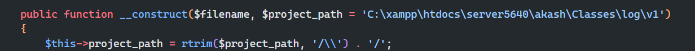
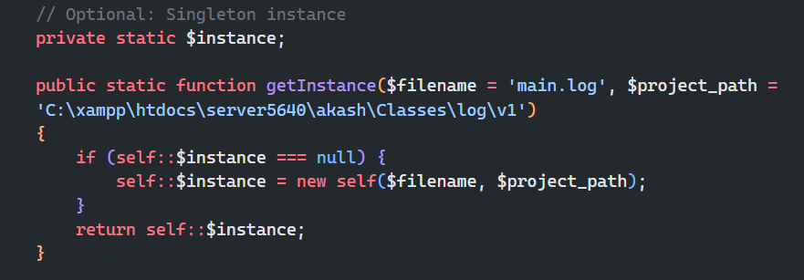

### PHP Logger

### Usage Of PHP Logger Version 1

In `v1/log.php` you have to define this two $project_path:

_1st_


_2nd_

-   $filename is `main.log` by default if we use Singleton instance.



#### A sample code how to use

-   First we imported the file
-   Then we define the namespace
-   Then we create a new instance of $logger
-   Then we attach the Error Handler `registerErrorHandler()`; // Optional
-   Then we shot the message
-   Message can be any data type.
-   You can use any Level you want to show to the message
-   A file named `v1.log` will be created next to log.php

`NOTE`

> The problem here is it will create a new instance everytime the file refresh or called. To solve this issue we will use singleton method.

```php
require_once './v1/log.php';

use Akash\Logging\Log;

$logger = new Log('v1.log');
$logger->registerErrorHandler();

$string = 'this is a error';
$arr = [1, true, 3.5, 'name', [1, 2], ["1" => 'one']];

$logger->write($arr);
$logger->write($string, 'ERROR'); // Can be any level you want
```

**Output:**
`v1/v1.log`

```log
[2025-03-19 7:31:10] [INFO]: [
    1,
    true,
    3.5,
    "name",
    [
        1,
        2
    ],
    {
        "1": "one"
    }
]
[2025-03-19 7:36:09] [ERROR]: this is a error
```

#### A sample code how to use [Singleton Method]

```php
require_once './v1/log.php';

use Akash\Logging\Log;

// Singleton usage
$singletonLogger = Log::getInstance();
$singletonLogger->write("Reusing the same logger instance.");
```

#### A complete walkthrough

```php
<?php
    require_once 'log.php';
    $logger = new Log('example_error.log'); // if you need to chnage the log file name
    $logger->registerErrorHandler();

    $arr = ["some name", "what is this even mean"];
    $obj = ["Name" => "Error", "Message" => "Something went wrong!"];

    try {
        $logger->write("This is an info message.");
        $logger->write("This is an error message.", "ERROR");
        $logger->write($arr);
        $logger->write($obj);

        // Singleton usage
        $singletonLogger = Log::getInstance();
        $singletonLogger->write("Reusing the same logger instance.");

        // Hide errors on the browser
        error_reporting(E_ALL);
        ini_set("display_errors", 0);

        // Trigger an error
        echo $undefinedVariable;

        // Trigger an uncaught exception
        throw new Exception("This is a test exception!");
    } catch (RuntimeException $e) {
        $error_msg = $e->getMessage();
        $logger->write($error_msg);
    }
?>
```

See an example in [use_v1.php](../usage/use_v1.php)
