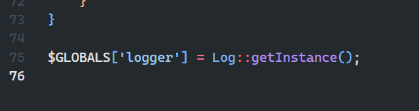
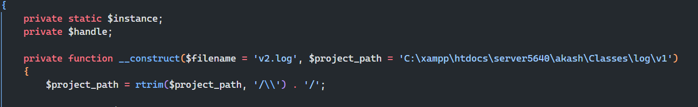
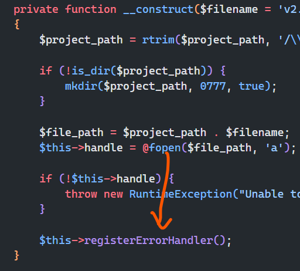

### PHP Logger

### Usage Of PHP Logger Version 2

-   So not a lot changed in version 2 I used singleton everywhere and so I decided to make it accessible globally.
-   At the end of the `v2/log.php` I added this line
-   It will create a instance and store it it global

    

-   Also you have to define the file name inside the `v2/log.php` now like this: 😅
-   And the `$project_path` is still same but reduced to one, so you only have to chnage this two name and path.



-   And the `registerErrorHandler()` is no more optional it will automatically registered.
-   You can still disable it in the `v2/log.php` file by commenting this:



#### How to import

-   No need to write namespace anymore.

```php
require_once './v2/log.php';

$logger = $GLOBALS['logger'];

$logger->write("This is an info message.");
$logger->write("This is an error message.", "ERROR");
$logger->write($arr);
$logger->write($obj);
```

-   Just two line and we are ready to use 😅

`OUTPUT`

```log
[2025-03-19 9:35:17] [INFO]: This is an info message.
[2025-03-19 9:35:17] [ERROR]: This is an error message.
```

See an example in [use_v2.php](../usage/use_v2.php)
